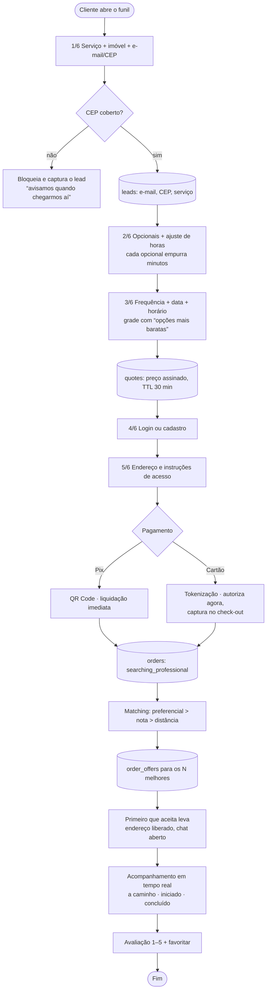
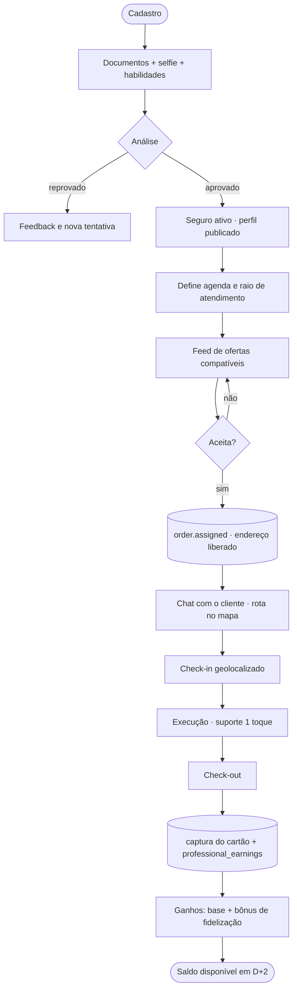
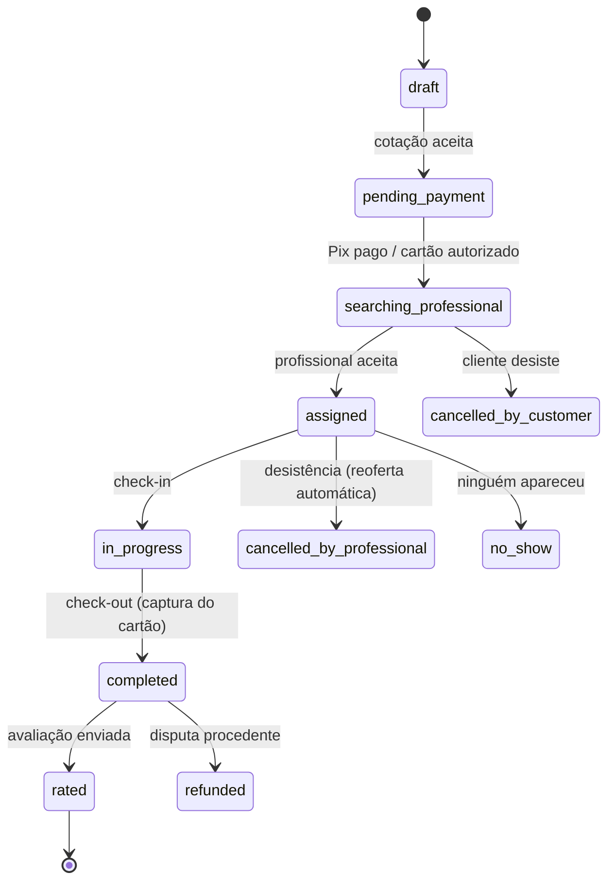

# Fluxos e Telas

Três aplicações sobre a mesma base: **cliente**, **profissional** e **backoffice**.

---

## 1. Jornada do cliente — do preço ao pagamento

### Telas do app do cliente

| Tela | Conteúdo | Detalhe que importa |
|---|---|---|
| Home | catálogo, prova social, planos | CTA de plano faz deep-link com `?frequency=` já aplicado |
| Funil (6 passos) | acordeão único, resumo sticky | preço recalculado a cada toque; nunca troca de URL |
| Meus serviços | próximos, histórico, recibos | permite remarcar dentro da política de cancelamento |
| Acompanhamento | status, perfil do profissional, chat | foto/nota só aparecem após a atribuição |
| Assinatura | pausar, pular semana, trocar profissional | pular ≠ cancelar — reduz churn |
| Assistência 24h | botão de emergência | nível de cobertura vem do plano |
| Indique e ganhe | código, saldo, extrato | crédito abate no próximo pedido |

---

## 2. Jornada do profissional

**Regras que o app precisa deixar explícitas**
- Endereço completo só após o aceite; telefone nunca é exibido.
- Check-out é o gatilho financeiro: captura o cartão e cria o ganho.
- Bônus de fidelização aparece na tela de ganhos, por cliente recorrente.
- Nota abaixo de 4,6 tira do feed até a reciclagem — informado com antecedência, nunca de surpresa.

---

## 3. Backoffice

| Módulo | O que resolve |
|---|---|
| Credenciamento | fila de análise, verificação de documentos, recheck periódico |
| Cobertura | faixas de CEP por região e serviço, ativação de cidade |
| Preços | editor de ruleset com **simulador lado a lado** e publicação versionada |
| Matching | pedidos sem profissional, reoferta manual, escalonamento |
| Financeiro | conciliação de pagamentos, lotes de repasse, margem por mês |
| Disputas | reembolso, taxa de cancelamento, reagendamento |
| Assistência | chamados abertos, despacho, custo coberto vs cobrado |

---

## 4. Máquina de estados do pedido

**Política de cancelamento (configurável por região)**
- Mais de 24h antes: sem taxa.
- Entre 24h e 4h: 30% do valor, integralmente repassado ao profissional.
- Menos de 4h ou no-show: 50%, integralmente repassado ao profissional.
- Cancelamento pelo profissional: sem custo ao cliente, reoferta automática e impacto no score.
